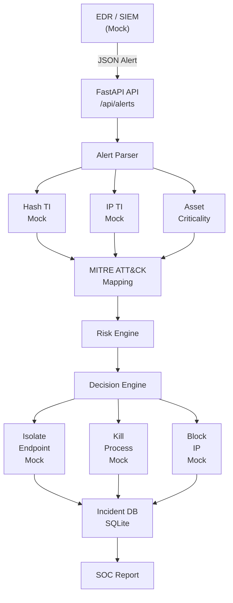

# SOAR-playbook

```mermaid
graph TD
    A["EDR / SIEM<br/>(Mock)"] -->|"JSON Alert"| B["FastAPI API<br/>/api/alerts"]
    B --> C["Alert Parser"]
    
    C --> D1["Hash TI<br/>Mock"]
    C --> D2["IP TI<br/>Mock"]
    C --> D3["Asset<br/>Criticality"]
    
    D1 --> E["MITRE ATT&CK<br/>Mapping"]
    D2 --> E
    D3 --> E
    
    E --> F["Risk Engine"]
    F --> G["Decision Engine"]
    
    G --> H1["Isolate<br/>Endpoint<br/>Mock"]
    G --> H2["Kill<br/>Process<br/>Mock"]
    G --> H3["Block<br/>IP<br/>Mock"]
    
    H1 --> I["Incident DB<br/>SQLite"]
    H2 --> I
    H3 --> I
    
    I --> J["SOC Report"]
```
